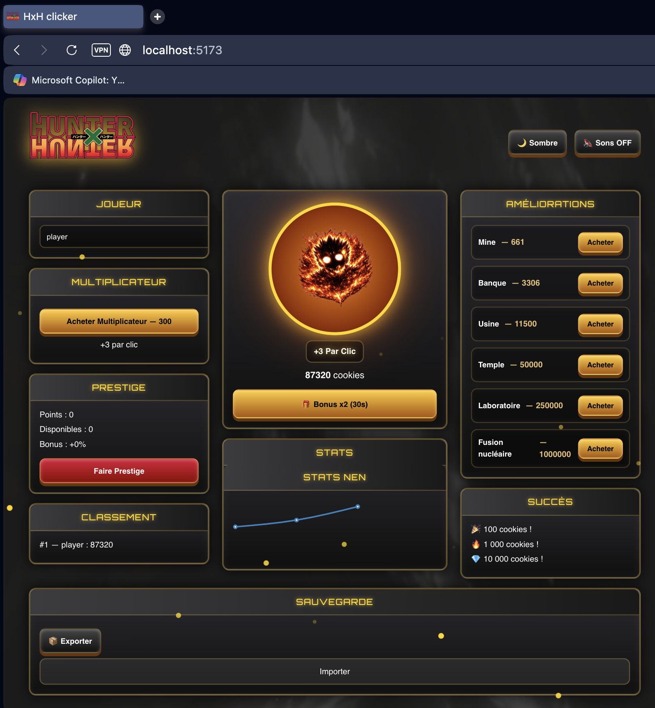

# 🕹️ Hunter x Hunter Clicker


------------------------------------------------------------------------

# 🕹️ Hunter x Hunter Clicker --- Fan Game

Un **clicker game moderne** inspiré de l'univers de **Hunter × Hunter**,
combinant une interface premium type RPG (style Cookie Clicker) avec des
effets visuels Nen, un système de prestige et une progression addictive.

------------------------------------------------------------------------

## ✨ Aperçu

🎮 Cliquez pour générer de l'énergie Nen\
🏆 Débloquez des succès\
⚡ Achetez des améliorations automatiques\
💎 Montez en prestige pour des bonus permanents\
🌌 Profitez d'un thème animé inspiré de Greed Island

------------------------------------------------------------------------

## 🚀 Fonctionnalités principales

-   🎯 **Click principal Nen** (symbole animé)
-   ⚡ **Bonus temporaire x2**
-   🏗️ **Améliorations automatiques** (production passive)
-   💎 **Système de Prestige** avec bonus cumulables
-   🏆 **Succès progressifs** (100 / 1 000 / 10 000...)
-   📈 **Leaderboard local** des meilleurs scores
-   💾 **Sauvegarde automatique** via LocalStorage
-   📦 **Import / Export JSON** des sauvegardes
-   🎧 **Sons activables/désactivables**
-   🌙 **Mode sombre dynamique**
-   ✨ **Particules Nen animées + Floating Text**

------------------------------------------------------------------------

## 🎨 Direction artistique

Le jeu reprend une ambiance fidèle à Hunter x Hunter :

-   Palette officielle **Hunter Association** 
-   Bouton spécial **Brigade Fantôme**
-   Fond animé style **Greed Island Wallpaper**
-   Effets lumineux Nen permanents
-   UI type **Fantasy RPG Premium**

------------------------------------------------------------------------

## 📂 Structure du projet

``` bash
src/
 ├── components/        # UI Components (ClickButton, Stats, Shop...)
 ├── data/              # Machines & améliorations
 ├── assets/            # Logos, symboles, backgrounds
 ├── App.jsx            # Logique principale du jeu
 ├── style.css          # Thème RPG complet + animations
```

------------------------------------------------------------------------

## 🛠️ Installation & Lancement

### 1. Cloner le projet

``` bash
git clone https://github.com/MOUADx4/hxh-clicker.git
cd cookie-clicker
```

### 2. Installer les dépendances

``` bash
npm install
```

### 3. Lancer en mode développement

``` bash
npm run dev
```

Le jeu sera accessible sur :

    http://localhost:5173

------------------------------------------------------------------------

## 🎮 Gameplay

1.  Cliquez sur le symbole Nen pour générer des cookies/points\
2.  Achetez des améliorations pour produire automatiquement\
3.  Activez des bonus temporaires x2\
4.  Atteignez 1 million pour débloquer le Prestige\
5.  Comparez vos scores dans le classement\
6.  Exportez votre progression en JSON

------------------------------------------------------------------------

## 💾 Sauvegarde

Le jeu sauvegarde automatiquement :

-   Score
-   Prestige
-   Améliorations
-   Leaderboard
-   Options (sons, mode sombre)

📦 Export possible en fichier `.json`\
📥 Import pour restaurer une partie

------------------------------------------------------------------------

## 📸 Screenshots


``` md



------------------------------------------------------------------------

## ⚠️ Licence & Disclaimer

Ce projet est un **fan-game non officiel**, réalisé uniquement à des
fins éducatives et de démonstration.

------------------------------------------------------------------------

### 🔥 Projet en cours d'amélioration

Prochaines features possibles :

-   Boss raids Nen
-   Skins Hisoka / Gon / Killua
-   Animations avancées
-   Shop avec icônes RPG

------------------------------------------------------------------------

